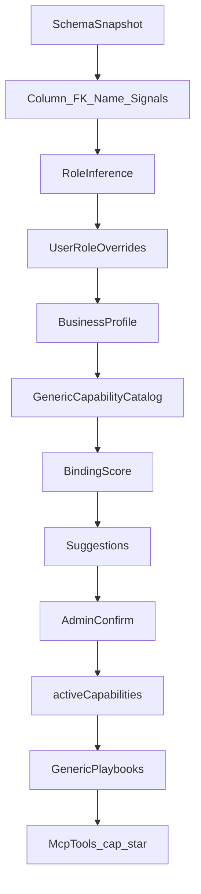

# Plano: de plataforma de conexão → IA de negócio (genérico)

> Status: Fase D concluída — ver [`POSITIONING.md`](./POSITIONING.md) + `GET /metrics`  
> Premissa: **nenhum cliente/schema específico é o produto**. Bases demo (`erpclient`, ProFitness, etc.) são só **fixtures de teste**.  
> Herda de: [`PLAN-BUSINESS-TOOLS.md`](./PLAN-BUSINESS-TOOLS.md) (catálogo + confirmar + MCP já implementados)

## Norte do produto

**Qualquer schema → papéis → tools/playbooks confirmáveis → MCP**  
sem importar dados e **sem SQL/NL livre gerado por LLM**.

Não vender: “integração com o banco X do cliente Y”.  
Vender: “o agente já consegue perguntas de negócio com tools seguras, em qualquer sistema conectado”.

## O que já existe (base)

- Conexão + introspecção + expose + REST/OpenAPI + MCP CRUD
- Heurísticas de domínio/papel + templates + ativação confirmada (`activeCapabilities`)
- LLM opcional só para priorizar IDs do catálogo (fail-closed)

Gap: ainda é MVP de **conexão + menu fixo de tools**. Falta semântica robusta + playbooks genéricos + prova multi-schema.

## Princípios (não negociáveis)

1. **Genérico primeiro** — templates amarrados a **papéis** (`party`, `event`, `ledger`, `survey`, …), não a nomes de tabela de um cliente.
2. **Sinônimos, não hardcodes** — `aluno` / `cliente` / `paciente` / `member` são aliases do mesmo papel.
3. **Override humano** — admin pode corrigir papel/binding; a heurística aprende a prioridade, não vira regra do cliente.
4. **Fixtures ≠ produto** — todo feature precisa passar em **≥2 schemas de domínios diferentes** antes de “pronto”.
5. **Sem SQL livre** — handlers só `list` / `getById` + filtros whitelist + agregação em memória controlada.

## Arquitetura-alvo

### Papéis canônicos (estáveis)

Catálogo curto e reutilizável entre verticais:

| Papel | Significado | Aliases (exemplos, não exaustivo) |
|-------|-------------|-----------------------------------|
| `party` | pessoa/organização de negócio | customer, member, aluno, paciente, contato |
| `event` | ocorrência no tempo ligada a party | checkin, visita, atendimento, ticket |
| `ledger` | cobrança/movimento financeiro | financeiro, invoice, payment, mensalidade |
| `catalog_item` | item vendável/estoque | product, plano, sku |
| `transaction` | pedido/venda | order, pedido |
| `survey` | avaliação/NPS | nps, review, feedback |
| `risk_snapshot` | série de risco/churn | churn_historico, risk_scores |
| `location` | unidade/filial | unidade, branch, loja |
| `staff` | usuário interno | user, gerente, employee |

Domínios (`erp_commerce`, `membership_retention`, `crm`, …) **só ordenam** o catálogo; não definem handlers separados por cliente.

### Capabilities genéricas (menu)

Amarradas a papéis, com bind por score:

| id | Precisa | Comportamento |
|----|---------|---------------|
| `search_parties` | party | busca nome/email/código |
| `party_summary` | party (+ opcional ledger/event) | ficha + totais/contagens |
| `list_at_risk` | party + sinais de risco | score/atraso/status/classificação |
| `recent_events` | party + event | eventos por party |
| `overdue_ledger` | ledger | status atraso / dias |
| `survey_overview` | survey | média + amostra |
| `risk_series` | risk_snapshot | últimos snapshots |
| `location_summary` | location | métricas da unidade se existirem |
| `explain_business_model` | qualquer | só metadados |

Aliases de templates atuais (`search_members`, `search_customers`, …) convergem para esses IDs (migration/compat `cap_*`).

### Playbooks (salto de “IA de negócio”)

Composições **genéricas** (várias leituras + resumo estruturado):

| id | Idea |
|----|------|
| `party_360` | party + events + ledger + survey (+ risk fields) |
| `attention_queue` | at_risk ∩ overdue ∩ sem evento recente |
| `location_health` | agrega risk_series + survey + ledger por location |

Playbook ≠ 1 tabela. Resposta tipada (JSON) acionável para o agente.

## Binding mais esperto

1. Score: nome do recurso + tokens + colunas (`email`, `status_*`, `*_id`, money, risk) + FKs.
2. Desempate: preferir entidade de negócio a satélite (`users` de auth perde para `clientes`/`alunos` se ambos candidatos a `party`).
3. Persistência: `BusinessProfile` + `roleOverrides` no SQLite do projeto.
4. Admin: UI “esta tabela é …” / “este campo é score de risco”.
5. LLM (opcional): só sugere papéis/IDs do catálogo; Zod fail-closed; sem rows.

## Admin (produto, não só ops)

- Após analyze: **sugerir pack por domínio** (“padrões de party+event+ledger detectados”) — pack = conjunto de capability IDs genéricos.
- Override de papéis inline.
- Preview de 1 capability/playbook (amostra limitada) sem sair do admin.
- Lista clara do que está ativo no MCP + feedback ao salvar (já iniciado).

## Fixtures de teste (não são roadmap de cliente)

| Fixture | Serve para validar |
|---------|-------------------|
| `erpclient` | party + transaction + catalog_item |
| schema tipo ProFitness | party + event + ledger + survey + risk_snapshot + location |
| 3º schema (CRM ou billing stub) | lead/contact ou subscription — **obrigatório** antes de fechar a fase |

Regra: feature só “done” se smoke passar em **pelo menos 2** fixtures.

## Fora de escopo

- SQL/NL livre gerado por LLM
- 1 tool automática por tabela
- Código/regra exclusiva de um tenant
- Agentes verticais grandes antes dos playbooks genéricos estáveis
- Novos adapters só por marketing (só sob demanda real)

## Fases de implementação

### Fase A — Semântica genérica (1–2 semanas)
- [x] Unificar papéis canônicos + aliases (deprecar overlap `member`/`customer` → `party` com compat)
- [x] Scoring por colunas/FK + preferência entidade vs satélite
- [x] `roleOverrides` na API/storage + UI mínima no admin
- [x] Smoke em `erpclient` + fixture retenção (`scripts/smoke-phase-a-semantics.mjs`)

### Fase B — Catálogo genérico (2–3 semanas)
- [x] Migrar templates para IDs genéricos (`search_parties`, …) com alias dos `cap_*` antigos
- [x] Pack suggestion por sinais (não por nome de cliente)
- [x] Preview no admin (`POST .../capabilities/:capId/preview`)
- [x] Smoke 2 fixtures (`scripts/smoke-phase-b-catalog.mjs`)

### Fase C — Playbooks (2–3 semanas)
- [x] `party_360`, `attention_queue`, `location_health`
- [x] Handlers compostos só com adapter whitelist
- [x] Descrições MCP otimizadas para o agente (when to use / args)
- [x] 3º fixture mínimo CRM (`scripts/smoke-phase-c-playbooks.mjs`)

### Fase D — Prova de produto
- [x] Métricas: % projetos com capability ativa; tempo até primeira pergunta útil; overrides/semana
- [x] Doc de posicionamento alinhado ao norte (conexão é infra; negócio é o pack/playbook) — [`POSITIONING.md`](./POSITIONING.md)

## Decisões fixadas neste plano

1. **Genérico > vertical de cliente** — verticais são rótulos de priorização, não forks de código.
2. **Confirmar antes de publicar** — mantém modelo do Business Tools.
3. **Fixtures multi-schema** — critério de pronto.
4. **LLM só no catálogo** — nunca inventa query.
