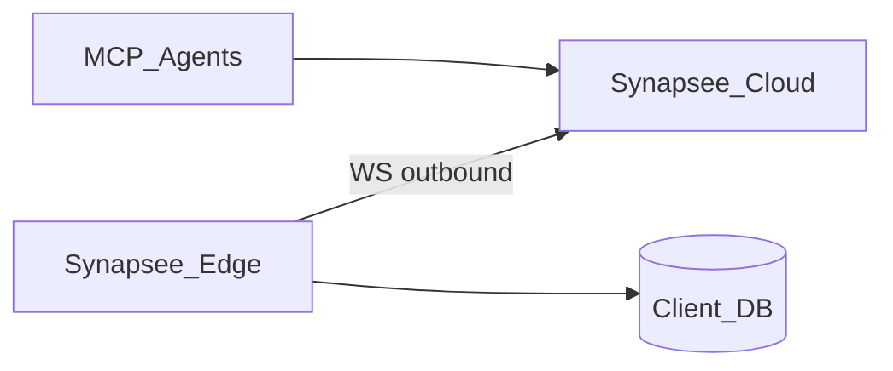

# Plano: Synapsee Edge (Cloud + Edge)

> Status: implementado (MVP)  
> Posicionamento: Edge é **como conectar com segurança**; o produto continua sendo entendimento do negócio ([`POSITIONING.md`](./POSITIONING.md)).

## Problema

O Cloud Synapsee hoje guarda credenciais e diala o banco do cliente. Empresas com política de rede restrita não podem abrir o banco para a internet.

## Princípio

O Edge **só inicia conexões de saída** (WebSocket) para o Cloud. O Cloud **nunca** abre TCP no ambiente do cliente.



## Modos

| Modo | Credenciais | Quem diala o DB |
|------|-------------|-----------------|
| `cloud` | Criptografadas no SQLite Cloud | API Synapsee |
| `edge` | Só no Edge (env) | Processo Edge |

## Contrato de jobs (MVP)

### Edge → Cloud

| Mensagem | Payload |
|----------|---------|
| `register` | `{ token, version, engine? }` |
| `heartbeat` | `{ status, engine?, resourceCount? }` |
| `jobResult` | `{ jobId, ok, data }` |
| `jobError` | `{ jobId, error }` |
| `schemaSnapshot` | `{ schema }` (metadados only) |

### Cloud → Edge

| Job `type` | Args |
|------------|------|
| `ping` | — |
| `testConnection` | — (usa config local do Edge) |
| `introspect` | — |
| `list` | `{ resource, limit, offset, filter? }` |
| `getById` | `{ resource, id }` |
| `insert` | `{ resource, data }` |

Timeout padrão de job: **30s**. Edge offline → HTTP 503 `Edge offline`.

## Threat model (resumo)

| Risco | Mitigação |
|-------|-----------|
| Token vazado | Hash no Cloud; revoke; mostrar plaintext **uma vez** |
| Edge offline | Status `offline`; jobs falham rápido com mensagem clara |
| Job lento / hang | Timeout + cancel no Edge |
| Exfiltração via schema | Só metadados (nomes/tipos); sem dump de rows no register |
| Cloud → cliente | Impossível por desenho (sem listener inbound no Edge) |

## Auth

- Admin / REST / MCP: `PLATFORM_API_KEY` (como hoje).
- Edge: **Project Token** (`syn_edge_…`) com hash SHA-256 armazenado.

## Fases

| Fase | Entrega |
|------|---------|
| 0 | Este doc |
| 1 | `connectionMode`, tokens, UI Docker snippet, status Edge |
| 2 | `apps/edge` + image + WS + proxy Cloud de jobs |
| 3 | Compose gerado no admin |
| 4 | Roadmap: Helm, HA (lease), audit logs, SSO/RBAC, on-prem control plane |

## Critérios MVP

- Onboarding só com token + Docker (banco inacessível da internet).
- Modo Edge: **sem** password no SQLite Cloud.
- Schema + 1 list via job Edge.
- Cloud não tenta TCP no host do cliente.

## DX — Compose, health, updates (Fase 3)

### Compose gerado no Admin

O painel (wizard / detalhe do projeto Edge) gera:

1. `docker run …` com `SYNAPSEE_TOKEN` + `SYNAPSEE_CLOUD_URL` + vars de DB  
2. `docker-compose.yml` equivalente (`restart: unless-stopped`, `extra_hosts` para `host.docker.internal`)

API: `POST /projects/edge`, `POST /projects/:id/edge-tokens`, `GET /projects/:id/edge/install`.

### Health / logs

- Edge: logs `[edge] connecting|registered|job …` no stdout do container  
- Cloud: `edge_status` / `edge_last_seen` no projeto; heartbeat a cada ~15s  
- `GET /edge/version` — versão esperada da image (sem auth)

### Política de update

1. Edge (ou operador) consulta `GET /edge/version`  
2. Se image local ≠ `synapsee/edge:latest` recomendada → `docker pull synapsee/edge:latest` + restart  
3. Watchtower / renovate opcional — **não** obrigatório no MVP  
4. Jobs em andamento: reconnect com backoff; jobs pendentes falham com timeout

Ver também [`apps/edge/README.md`](../apps/edge/README.md).

## Fase 4 — Roadmap enterprise (não MVP)

Escopo futuro; **não** bloqueia o MVP Cloud+Edge.

| Item | Notas |
|------|--------|
| **Helm chart `synapsee-edge`** | Mesma image; secrets via K8s Secret; probes em processo local (não inbound Cloud) |
| **HA (2+ Edges)** | Lease de job por `projectId` (só um Edge processa; outro standby) |
| **Audit log** | Persistir `jobId`, tipo, duração, ok/erro (sem rows de negócio) |
| **SSO / RBAC** | Login plataforma (OIDC); papéis admin vs viewer por projeto |
| **Control plane on-prem** | Cloud Synapsee opcionalmente self-hosted na rede do cliente |

### Sketch Helm (futuro)

```yaml
# charts/synapsee-edge/values.yaml (roadmap)
image:
  repository: synapsee/edge
  tag: latest
env:
  SYNAPSEE_CLOUD_URL: https://api.synapsee.example
secretRef: synapsee-edge-creds  # TOKEN + DB_*
```

## Referência rápida de código

| Peça | Path |
|------|------|
| Edge worker | `apps/edge` |
| Gateway WS | `apps/api/src/edge/gateway.ts` |
| Proxy Cloud↔Edge | `apps/api/src/edge/dataAccess.ts` |
| Tokens / mode | `packages/storage/src/projects.ts` |
| Admin UI | `apps/admin` (wizard Cloud/Edge + `EdgeInstallPanel`) |
