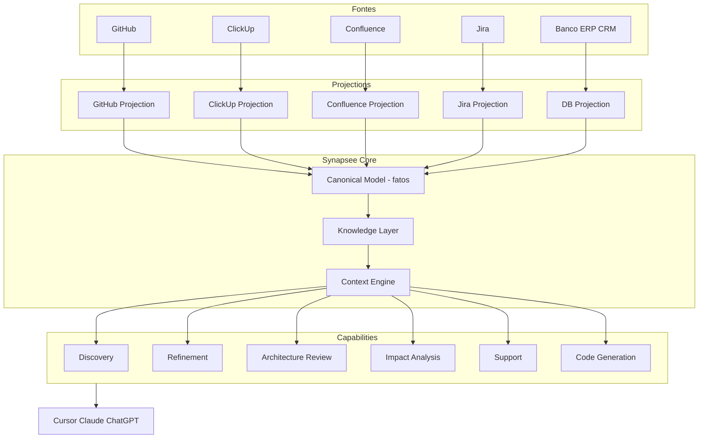

# Plano: Synapsee Engineering Knowledge (MVP 30 dias)

> O Synapsee é uma **plataforma** que transforma conhecimento organizacional em capacidades que agentes de IA utilizam. Engineering Knowledge é o **primeiro vertical** além de Business — não um produto “Discovery Agent”.

## Tese da plataforma

```
Synapsee Platform
│
├── Context Engine          ← ativo principal
│
├── Business Knowledge
│   ├── ERP / Banco
│   ├── CRM
│   ├── Billing
│   └── Financeiro
│
├── Engineering Knowledge
│   ├── GitHub
│   ├── ClickUp
│   ├── Jira          (depois)
│   └── Confluence    (depois)
│
└── (Futuro)
    ├── SAP / Salesforce
    ├── SharePoint
    └── Slack
```

**Frase:** Synapsee cria uma **camada de contexto** entre o conhecimento da empresa e os agentes de IA.

Especialistas são aplicações dessa camada — não o produto:

| Vertical | Especialistas (exemplos) |
|----------|--------------------------|
| Business | Financeiro, Comercial, Cobrar, Reter |
| Engineering | **Discovery** (MVP), Refinement, Architecture Review, Impact Analysis, Support, Code Generation |

MCP continua só como **entrega** (`cap_*` / REST). O cliente nunca compra “grafo” nem “conector” — compra contexto + capacidades.

---

## Arquitetura alvo



### Camadas (vocabulário de produto)

| Termo interno | O que é | O que o cliente vê |
|---------------|---------|-------------------|
| **Projection** | Traduz uma fonte (GitHub API, ClickUp API…) → modelo canônico | “Conectar GitHub” |
| **Canonical Model** | Entidades e relações **factuais** | — (invisível) |
| **Knowledge Layer** | Persistência + busca do modelo (SQL, vetores, grafo, docs — detalhe de implementação) | — (invisível) |
| **Context Engine** | Monta contexto relevante para uma pergunta / capability | “O Synapsee entende o conhecimento da empresa” |
| **Capability / Especialista** | Discovery, Impact Analysis… | “Discovery Técnico” |

**Não vender “Knowledge Graph”.** O grafo (ou Postgres + FTS, ou vetores) é só uma implementação da Knowledge Layer.

---

## Projection (por fonte)

Cada fonte conhece **só a própria estrutura** e emite fatos canônicos.

```
GitHub  → GitHub Projection  → Canonical Model → Knowledge Layer
ClickUp → ClickUp Projection → Canonical Model → Knowledge Layer
```

Amanhã: `SAP Projection`, `Salesforce Projection`, `Jira Projection`, `Azure DevOps Projection` — sem mudar o Context Engine.

Contrato (Edge / packages):

```ts
interface SourceProjection {
  kind: "github" | "clickup" | /* ... */;
  testConnection(): Promise<void>;
  introspectScopes(): Promise<ScopeMeta[]>;
  /** Emite apenas fatos canônicos + proveniência */
  project(cursor?): AsyncIterable<CanonicalFact>;
  getByExternalId(type, id): Promise<CanonicalEntity | null>;
}
```

Tokens no Edge (`SYNAPSEE_GITHUB_TOKEN`, `SYNAPSEE_CLICKUP_TOKEN`). Jobs: `projection.test`, `projection.syncPage`, `projection.get`.

---

## Canonical Model — só fatos

O modelo **armazena fatos**. Conclusões (risco, débito, decisão) saem das capabilities.

**Fatos (persistidos):**

- Trabalho: `Story`, `Task`, `Epic`
- Código: `Repository`, `Branch`, `Commit`, `PullRequest`
- Estrutura: `Module`, `Service`, `API`
- Docs: `Document` (quando houver fonte)

**Arestas factuais:**

- `Story` → `child` → `Task`
- `Task` → `implements` → `PullRequest` (quando houver evidência: branch, título, commit msg)
- `PullRequest` → `contains` → `Commit`
- `Commit` / `PR` → `touches` → `Module`
- `Task` → `related_to` → `Task` (similaridade / link explícito)

**Não persistir como entidade:** `Risk`, `TechnicalDebt`, `Decision` — são **conclusões** do Discovery (e outros especialistas), com evidências apontando para fatos.

Cada fato guarda: `source`, `externalId`, `url`, `title`, `updatedAt`, texto indexável, `payload`.

Exemplo:

```
ClickUp Task #452 "Implementar login Google"     ← fato
  → GitHub PR #385 "login-google"                ← fato + aresta
  → Commit → paths auth/**                       ← fato
  → Module Authentication                        ← fato (heurística de path)
```

Discovery **conclui** riscos / débitos / perguntas em aberto a partir desses fatos.

---

## Knowledge Layer (implementação)

Store enxuto em `packages/storage` (MVP = tabelas relacionais; trocável depois):

- `kl_nodes` — fatos canônicos
- `kl_edges` — relações factuais + `evidence_json` + `score`
- `kl_sync_state` — cursor por projection

Busca MVP: FTS / matching determinístico. Embeddings **só na semana 4**, se necessário para organizar contexto — não bloqueiam semanas 1–3.

API interna: Context Engine pergunta à Knowledge Layer (`get`, `traverse`, `searchFacts`) — sem expor “grafo” no Admin/landing.

---

## Context Engine

Não é um agente único. É o runtime que:

1. Resolve a intenção (ex.: Discovery sobre Task X)
2. Coleta fatos relevantes na Knowledge Layer (+ fetch quente via Edge se preciso)
3. Entrega um **contexto estruturado** à capability
4. A capability formata a resposta (opcionalmente LLM só para redigir a partir de evidências)

Assim Discovery, Refinement, Impact Analysis etc. reutilizam a mesma engine.

---

## Capability MVP: Discovery Técnico

Primeira capability do vertical Engineering. As demais ficam no backlog de contratos.

### `cap_discover_story`

**Input:** Task/Story id (ClickUp) ou URL/texto.

**Output estruturado:**

- Resumo
- Objetivo
- **O que já existe**
- Dependências
- Módulos afetados
- PRs semelhantes
- Commits semelhantes
- Documentação relacionada (quando houver `Document`)
- Riscos *(conclusão)*
- Débitos técnicos *(conclusão)*
- Checklist
- **Perguntas ainda não respondidas** *(alto valor)*

Exemplo da última seção:

```
Ainda precisamos definir
☐ Estratégia de rollback
☐ Feature Flag
☐ Migração
☐ Critérios de aceite
☐ Observabilidade
```

Implementação: Context Engine monta evidências → LLM (semana 4) organiza → resposta. Sem API/SQL livre gerada pela IA.

**Backlog pós-MVP (contratos apenas):**

- Refinement / Criticar história (`cap_critique_story`)
- Impact Analysis (`cap_impact_analysis`)
- Architecture Review
- Pré-refinamento PO (`cap_pre_refine`)
- Support / Code Generation (bem depois)

---

## Story OS (próximo horizonte)

Ver [PLAN-STORY-OS.md](./PLAN-STORY-OS.md): pipeline
`Story → Understand → Refine → Impact → Plan → Execute`.

- **Understand** = Discovery atual (`eng_understand_story`, alias `discover_story`)
- Demais etapas: stubs no pack Engineering (Fases B–E)

Posicionamento: [POSITIONING.md](./POSITIONING.md)

---

## Pensar em Vertical, não em Conectores

No Admin e no pitch:

1. Criar projeto do vertical **Engineering Knowledge**
2. Adicionar fontes (GitHub, ClickUp…) — detalhe operacional
3. Sync → Knowledge Layer
4. Ativar especialista Discovery
5. Publicar capacidades para agentes

Conectores/projections são implementação. O produto vendido é o **vertical** sobre a **Context Engine**.

---

## Roadmap 30 dias (enxuto)

### Semana 1 — GitHub → Knowledge Layer

- Vertical `engineering` + jobs de projection no Edge
- `GitHub Projection` (PAT): repos, PRs, commits, branches
- Persistência `kl_*` (fatos)
- Sync visível no Admin (contagem de fatos)

### Semana 2 — ClickUp → Knowledge Layer

- `ClickUp Projection`: spaces, lists, tasks, comments, custom fields
- Mesmo Canonical Model / Knowledge Layer
- Admin: adicionar fonte ClickUp + sync

### Semana 3 — Linking factual + resposta sem LLM

- Linker determinístico Task ↔ PR ↔ Commit ↔ Module (path)
- `cap_discover_story` devolve contexto estruturado **só com fatos + templates** (sem LLM)
- Preview no Admin: Task → o que já existe / PRs / commits / módulos

### Semana 4 — Context Engine + LLM + publish

- [x] LLM opcional (`OPENAI_API_KEY`) para organizar contexto / conclusões / perguntas em aberto
- [x] Publicar via MCP/REST (`cap_discover_story`)
- [x] Copy: camada de contexto + Discovery (`POSITIONING.md`)
- [x] Smoke e2e local: `npx tsx scripts/smoke-engineering-knowledge.mjs`
- [ ] Landing atualizada com pitch Engineering (pendente)

**Fora dos 30 dias:** Confluence, Jira, GitLab, Azure DevOps, geração de código, demais especialistas publicados.

---

## Gaps vs código atual

| Peça | Estado | Precisa |
|------|--------|---------|
| Edge | Jobs de DB | Runtime de **projections** |
| Adapter | `DatabaseAdapter` | `SourceProjection` (+ DB vira uma projection depois) |
| Semântica | Roles sobre tabelas | Canonical Model de fatos + Knowledge Layer |
| Capabilities | `list`/`getById` SQL-shaped | Context Engine → handlers por vertical |
| Packs | commerce / retention | Pack engineering + Discovery |
| Admin | Wizard DB | Wizard de **vertical** + fontes |

Arquivos-âncora: `apps/edge/src/main.ts`, `apps/api/src/edge/gateway.ts`, `packages/core/src/adapters/types.ts`, `packages/core/src/capabilities/`.

---

## Invariantes

- Plataforma de conhecimento → capacidades; verticais são aplicações
- Context Engine é o ativo; Discovery é a primeira capability Engineering
- Knowledge Layer é implementação (não “vendemos grafo”)
- Projection por fonte → Canonical Model (só fatos)
- Conclusões saem das capabilities, não do store
- Segredos no Edge; você aprova o que publica
- MCP = entrega
- Business Knowledge continua intacto

---

## Riscos e mitigação

| Risco | Mitigação |
|-------|-----------|
| Escopo inchado | Semanas 1–3 sem LLM/embeddings; só fatos + linking |
| Linking fraco | Regras de ID/branch/título + UI “confirmar link” depois |
| Rate limits | Sync incremental + cache na Knowledge Layer |
| Confusão ERP vs Eng | Copy de **plataforma + verticais**; Admin tipado por vertical |
| Vazar “grafo” no pitch | Vocabulário fixo: Context Engine / Knowledge Layer / Projection |

---

## Definição de pronto (MVP)

1. Vertical Engineering com fontes GitHub + ClickUp (Edge)
2. Knowledge Layer com fatos canônicos + arestas Task↔PR↔Commit↔Module
3. Preview Admin de Discovery (fatos + conclusões + perguntas em aberto)
4. Capability publicada via MCP para Cursor
5. Posicionamento atualizado: plataforma / Context Engine / verticais

---

## Todos de implementação

- [x] Vertical `engineering` + jobs `projection.*` no Edge
- [x] Knowledge Layer (`kl_nodes` / `kl_edges` / `kl_sync_state`) — sem expor “grafo”
- [x] GitHub Projection (semana 1)
- [x] ClickUp Projection (semana 2) + comments
- [x] Linker factual Task↔PR↔Commit↔Module (semana 3)
- [x] Context Engine mínimo + Understand (`eng_understand_story` / alias `discover_story`)
- [x] Story OS Fase A–E (Understand → Execute)
- [ ] Landing Engineering / Story OS
- [ ] Persistência de artefatos por etapa (Story OS)

---

## Ver também

- [PLAN-KNOWLEDGE-BUILDER.md](./PLAN-KNOWLEDGE-BUILDER.md) — LLM como motor; enrichments persistidos na KL
- [PLAN-STORY-OS.md](./PLAN-STORY-OS.md)
- [PLAN-MISSION-ENGINE.md](./PLAN-MISSION-ENGINE.md)
- [POSITIONING.md](./POSITIONING.md)
