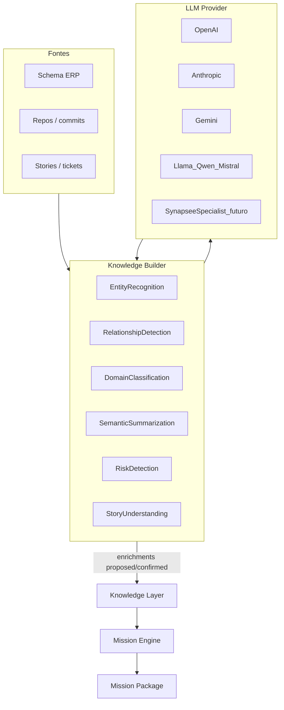

# Plano — Knowledge Builder + LLM como motor

> LLM como motor trocável · enriquecimento validado e persistido na Knowledge Layer · Mission Engine reutiliza conhecimento.
>
> O LLM **não** é o produto. O valor continua sendo do Synapsee.

## Análise (estado atual vs visão)

**O que já existe e está alinhado**
- Knowledge Layer persistente (`kl_nodes` / `kl_edges` em [`packages/storage/src/knowledge.ts`](../packages/storage/src/knowledge.ts)) — fatos de fonte + linker determinístico.
- Pipeline Story OS / Mission Engine que monta Mission Packages a partir de fatos + capabilities.
- LLM opcional OpenAI (`OPENAI_API_KEY` / `OPENAI_MODEL`) em dois pontos fail-closed:
  - Business: [`packages/core/src/capabilities/llm.ts`](../packages/core/src/capabilities/llm.ts) (schema → domínio/tools)
  - Engineering: [`packages/core/src/knowledge/llm.ts`](../packages/core/src/knowledge/llm.ts) (polimento do Discovery)
- Invariante documentado: “KL = fatos; conclusões ficam nas capabilities” — bom para não poluir a KL com alucinação, **mas bloqueia o modelo de reuso** desta visão.

**O gap central**
Hoje o fluxo é:

```text
História → Context Engine → (GPT opcional) → resposta → fim
```

Mil histórias ≈ até mil chamadas. O GPT **não alimenta** a KL. Missões reexecutam o pipeline; `mission_runs` guarda snapshot do package, não conhecimento acumulado.

**O que a visão exige**

```text
Fonte/commit/schema → Knowledge Builder → LLM Provider → validação → Knowledge Layer
                              ↓
                     Mission Engine (reusa)
```

LLM = analista contratado. Quem “aprende” = Synapsee (KL). Valor do produto permanece no Synapsee.

**Decisão de produto (invariante refinada)**

| Pode persistir na KL | Não persiste como fato |
|----------------------|-------------------------|
| Papel de entidade (`Party`, `Ledger`, `Service`) | Briefing livre de uma missão |
| Relacionamentos tipados + evidência | Conclusão ad-hoc sem validação |
| Resumo semântico **ancorado** a um nó (ex.: papel do `PaymentService`) | SQL/código inventado pelo LLM |
| Tags de domínio / risco **propostos** com status | Qualquer output sem `proposed\|confirmed\|rejected` |

Ou seja: a KL continua sendo conhecimento durável — agora inclui **enriquecimentos confirmados** (ou propostos com provenance), não só projeção de fonte.

---

## Arquitetura alvo



**Componentes**
1. **`LlmProvider`** — interface única (`completeJson` / tasks tipadas). Implementações: OpenAI (já existe), depois Anthropic/Gemini/local. Env + config por projeto no futuro.
2. **`KnowledgeBuilder`** — orquestra tarefas de enriquecimento; **nunca** é o chatbot do usuário; só transforma evidência estruturada em candidatos tipados.
3. **Knowledge Layer** — fatos de fonte + tabela/camada de enrichments com provenance.
4. **Mission Engine** — lê KL enriquecida; só chama LLM via Builder quando faltar conhecimento fresco.

---

## Modelo de persistência (concreto)

Nova unidade: **Knowledge Enrichment** (nome interno; UX pode dizer “conhecimento enriquecido”).

Campos mínimos (SQLite, junto à KL):
- `id`, `project_id`, `subject_id` (nó KL ou resource de schema)
- `kind`: `entity_role | relationship | domain_tag | semantic_summary | risk_signal | module_map`
- `payload_json` (tipado por `kind`)
- `confidence`, `status` (`proposed | confirmed | rejected`)
- `provider`, `model`, `prompt_version`, `input_fingerprint`
- `evidence_json` (trechos/IDs que embasaram)
- `created_at`, `updated_at`

**Idempotência:** se `subject_id + kind + input_fingerprint` já tem enrichment `confirmed` ou `proposed` fresco → **não** chama LLM de novo.

**Promoção:** enrichments `confirmed` de relacionamento podem virar `kl_edges`; papéis de serviço podem materializar nós `Service`/`API` (tipos já existem no canonical model, hoje pouco usados).

Business: papéis tipo Party/Ledger hoje vivem em `business_profile_json` + heurísticas. O Builder unifica isso como enrichments reutilizáveis (além do profile operacional das caps).

---

## Fases de entrega

### Fase 0 — Contrato e provider único — feito
- `LlmProvider` em [`packages/core/src/llm/`](../packages/core/src/llm/) (OpenAI + OpenAI-compatible via `OPENAI_BASE_URL`).
- Discovery e analyze usam o provider; fail-closed sem key.
- Invariante: KL = fatos de fonte + enrichments duráveis com status.

### Fase 1 — Knowledge Builder MVP (Engineering-first) — feito
1. **Semantic summarization** → enrichment `semantic_summary`.
2. **Entity role** → propor `Service`/`API` (confirm promove nó).
3. Trigger pós-`knowledge/sync` + `POST .../knowledge/enrich`.
4. Admin: aba **Conhecimento** (confirm/reject).

### Fase 2 — Mission Engine consome enrichments — feito
- Context Engine aplica enrichments antes de `refineDiscoveryWithLlm`; pode pular LLM (`llmCallsSaved`).
- Eventos `cap_preview` registram `enrichmentsHit` / `llmCallsSaved`.
- Summaries entram em `whatAlreadyExists` (Mission Package).

### Fase 3 — Business Builder (ERP) — feito
- Analyze persiste `domain_tag` + `entity_role` (Party/Ledger…) como enrichments.
- Role overrides humanos → enrichments `confirmed`.
- `collect_overdue` lê Knowledge Layer (`loadBusinessKnowledge`) e inclui domínio/papéis no Mission Package + brief.
- Admin Capabilities: lista/confirm/reject de enrichments business.

### Fase 4 — Multi-provider — feito
- Providers: OpenAI, Anthropic, Gemini, OpenAI-compatible (`OPENAI_BASE_URL` / Ollama/vLLM).
- Env `LLM_PROVIDER` + config por projeto (`GET/PUT /projects/:id/llm-config`, key criptografada).
- Admin: painel **LLM Provider**.

### Fase 5 — Roadmap (fora deste trilho): modelo Synapsee
- Mesma interface `LlmProvider`.
- Modelo pequeno (2B–7B) treinado/fine-tuned **só** em tarefas do Builder.
- Não é chatbot; especialista em “sistema empresarial → conhecimento estruturado”.

---

## O que não fazer neste trilho
- Substituir Mission Engine / MCP / plugin por “chat com GPT”.
- Persistir SQL gerado por LLM ou rows do cliente no prompt de enriquecimento (manter regra atual: metadados/evidência estruturada).
- Treinar modelo próprio (Fase 5).
- Expandir escopo do plano de superfícies ([`PLAN-PLATFORM-SURFACES.md`](./PLAN-PLATFORM-SURFACES.md)) — SDKs/plugin continuam consumidores do REST; Builder é núcleo.

---

## Ordem recomendada e critério de valor

| Fase | Entrega | Valor |
|------|---------|--------|
| 0 | Provider + doc + invariante | Base limpa |
| 1 | Builder + persistência + confirm/reject | Conhecimento começa a acumular |
| 2 | Missões reusam | Economia de token mensurável |
| 3 | Business na mesma arquitetura | Party/Ledger como knowledge Synapsee |
| 4 | Providers trocáveis | LLM commodity |
| 5 | Modelo Synapsee | Diferencial de longo prazo |

**Frase norte:** o LLM é o motor; o cérebro e o aprendizado são do Synapsee (Knowledge Layer + Mission Engine).

## Ver também

- [POSITIONING.md](./POSITIONING.md)
- [PLAN-ENGINEERING-KNOWLEDGE.md](./PLAN-ENGINEERING-KNOWLEDGE.md)
- [PLAN-MISSION-ENGINE.md](./PLAN-MISSION-ENGINE.md)
- [PLAN-PLATFORM-SURFACES.md](./PLAN-PLATFORM-SURFACES.md)
- [PLAN-STORY-OS.md](./PLAN-STORY-OS.md)
