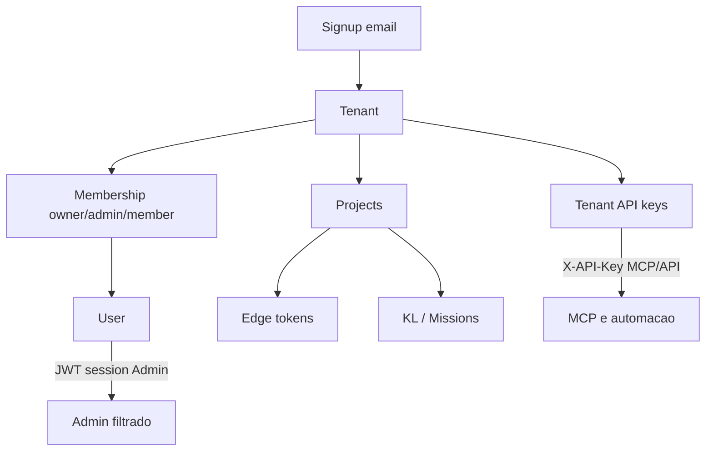

# Self-serve multi-tenant Synapsee

> Status: implementado (MVP core + quotas soft). Billing Stripe = fase seguinte.  
> Objetivo: cada empresa no seu **Tenant**, no mesmo deploy, sem leak cross-tenant.

## Meta

Visitante cria conta → vira **Tenant (empresa)** → só vê e opera os **Projects** dela → MCP/Edge usam credenciais daquele tenant → impossível acessar projeto de outro tenant mesmo conhecendo o UUID.

**Não é o produto.** É a base para vender N empresas no mesmo deploy.

Hoje o Synapsee isola por **Project** com uma `PLATFORM_API_KEY` global (modo operador). Este plano muda isso para SaaS self-serve.

## Modelo alvo

Hierarquia fixa: **Tenant → Project → (Edge, KL, Missions)**.  
Project ganha `tenant_id` obrigatório. Não existe project “órfão” no self-serve.

## Decisões travadas (MVP)

| Tema | Decisão |
|------|---------|
| Auth Admin | Email + senha → JWT (httpOnly cookie ou Bearer). Troca o “colar PLATFORM_API_KEY”. |
| Auth máquina (MCP) | Preferir chaves **por projeto / por dev** (`syn_mcp_…`) — escopo = 1 project, sem gestão de tenant; Admin gera e entrega. `syn_tk_…` permanece para automação/ops (tenant inteiro); **não** colar no Cursor compartilhado. |
| Super-admin | `PLATFORM_API_KEY` fica só para ops internas (listar todos tenants, suporte). Nunca entregue ao cliente. |
| Roles | `owner` \| `admin` \| `member` no membership. Owner/admin: CRUD projects + keys. Member: operar missões/KL no project. |
| Signup | `POST /auth/signup` cria User + Tenant + membership owner + primeira API key (mostrada 1×). |
| Billing no 1º corte | **Não.** Campo `plan` no tenant (`beta` / futuros) + **quotas soft** locais. Stripe numa fase seguinte. |
| Storage | Mesmo SQLite do platform store, novas tabelas. Migração: projects existentes → tenant `Legacy / Ops`. |

---

## Fase 0 — Documento e contratos

Este arquivo. Atualizar menção SaaS em [PLAN.md](./PLAN.md) e [POSITIONING.md](./POSITIONING.md) (self-serve = tenant isolation).

---

## Fase 1 — Schema + storage

Em `packages/storage`:

**Tabelas novas**

- `tenants` — `id`, `name`, `slug`, `plan`, `status`, `created_at`
- `users` — `id`, `email` (unique), `password_hash`, `name`, `created_at`
- `memberships` — `tenant_id`, `user_id`, `role`, PK composta
- `tenant_api_keys` — `id`, `tenant_id`, `name`, `token_hash`, `prefix`, `created_at`, `revoked_at`
- `tenant_quotas` (ou colunas em `tenants`) — `max_projects`, `max_mission_runs_month`

**Alteração**

- `projects.tenant_id TEXT NOT NULL` (+ index). Migração: criar tenant sistema e backfill.

**API de store**

- `createTenantWithOwner`, `listProjectsForTenant(tenantId)`, `getProjectInTenant(projectId, tenantId)`, `resolveApiKey(raw) → { tenantId }`, users/memberships CRUD mínimo.

Toda leitura de project que hoje é `store.get(id)` passa a ter variante **scoped** ou o caller obriga check de tenant.

---

## Fase 2 — Auth na API

Substituir o plugin binário em `apps/api/src/plugins/auth.ts`:

1. Rotas públicas: `/health`, `/auth/signup`, `/auth/login`, `/edge/ws`, `/edge/version`.
2. Resolver credencial:
   - `Authorization: Bearer <jwt>` → `{ type: "user", userId, tenantId, role }` (MVP: 1 tenant por user; schema permite evoluir).
   - `X-API-Key: syn_tk_…` → `{ type: "tenant_key", tenantId }`.
   - `X-API-Key: PLATFORM_API_KEY` → `{ type: "platform" }`.
3. Anexar `req.auth` (Fastify decorate).
4. Helper `assertProjectAccess(projectId)` → 404 se project não pertence ao tenant (evitar enumeraçāo com 403 diferente).

**Rotas auth**

- `POST /auth/signup` `{ email, password, companyName }`
- `POST /auth/login` → JWT
- `GET /auth/me`
- `POST /tenants/:id/api-keys` / `GET` / `DELETE` (owner/admin)

**Hardening de listagens**

- `GET /projects` → só projects do `auth.tenantId` (platform vê todos).
- `POST /projects` / `POST /projects/edge` → grava `tenant_id`; rejeita se quota `max_projects`.
- Todas as rotas `/projects/:id/*`, `/p/:projectId/mcp`, knowledge, missions, edge-tokens: passar por `assertProjectAccess`.

Edge tokens **continuam por project** (já isolados); criação só se o project for do tenant.

---

## Fase 3 — Admin filtrado + signup UX

`apps/admin`:

- Login: email/senha (manter fallback “API key de tenant” opcional para MCP troubleshooting).
- Guardar JWT (não a god-key).
- Lista de sistemas já filtrada pelo backend — UI não precisa “esconder”; nunca confiar só no client.
- Tela **Conta / API keys**: criar, copiar 1×, revogar.
- Signup page (ou link da landing waitlist → “Criar conta” quando beta abrir).
- Mock mode: tenant fake + user para não quebrar `VITE_USE_MOCK`.

Snippets MCP em `apps/api/src/routes/mcp.ts` / `McpConnectPanel`: placeholder vira `<TENANT_API_KEY>`, não `PLATFORM_API_KEY`.

---

## Fase 4 — Quotas (sem Stripe)

- Defaults por `plan`: ex. `beta` = 3 projects, 200 mission runs/mês.
- Enforce em `POST /projects*` e ao iniciar mission run.
- `GET /tenants/current` (ou `/auth/me`) devolve uso vs limite para o Admin mostrar barra simples.
- Eventos em `product_events` com `tenant_id` (além de `project_id`) para métricas.

---

## Fase 5 — Billing (depois do core estável)

- Stripe Customer ligado a `tenants.stripe_customer_id`.
- Checkout / Customer Portal; webhook atualiza `plan` + quotas.
- Planos alinhados à landing (Starter / Business / Enterprise).
- Enterprise pode continuar “dedicated deploy” fora deste modelo.

Não bloqueia venda managed atual; habilita self-serve pago.

---

## Anti-leak (checklist obrigatório)

Cada item é critério de “pronto”:

- [x] Nenhum `store.list()` sem filtro de tenant em rota de cliente
- [x] `get(projectId)` sempre + `tenant_id` match (404)
- [x] MCP e REST compartilham o mesmo assert
- [x] JWT sem tenant estranho no path
- [x] Testes: User A não lê project de User B (`scripts/smoke-multi-tenant.mjs`)
- [x] Rate limit por `tenantId` / user (keyGenerator)
- [x] Platform key fora dos snippets do Admin (`<TENANT_API_KEY>`)
- [ ] Logs auditáveis por tenant (melhoria contínua)

Smoke: script `scripts/smoke-multi-tenant.mjs` — signup A, signup B, criar project em A, request com key B → 404.

---

## Ordem de implementação

1. Schema + migração legacy
2. Auth plugin + signup/login + `req.auth`
3. Scope em projects/MCP/knowledge/missions
4. Admin login JWT + API keys UI
5. Quotas soft
6. Doc + smoke
7. (Depois) Stripe

## Fora de escopo neste plano

- SSO / SAML
- Um user em N tenants (MVP: 1 membership; schema já permite evoluir)
- Row-level no SQLite do cliente ERP (isso é do domínio do cliente)
- Separar DB físico por tenant

## Sucesso

Dá para dizer com honestidade: **“cada empresa no seu tenant”** — self-serve, Admin filtrado, keys próprias, sem leak cross-tenant. Billing fecha a monetização; o core de isolamento vem antes.
