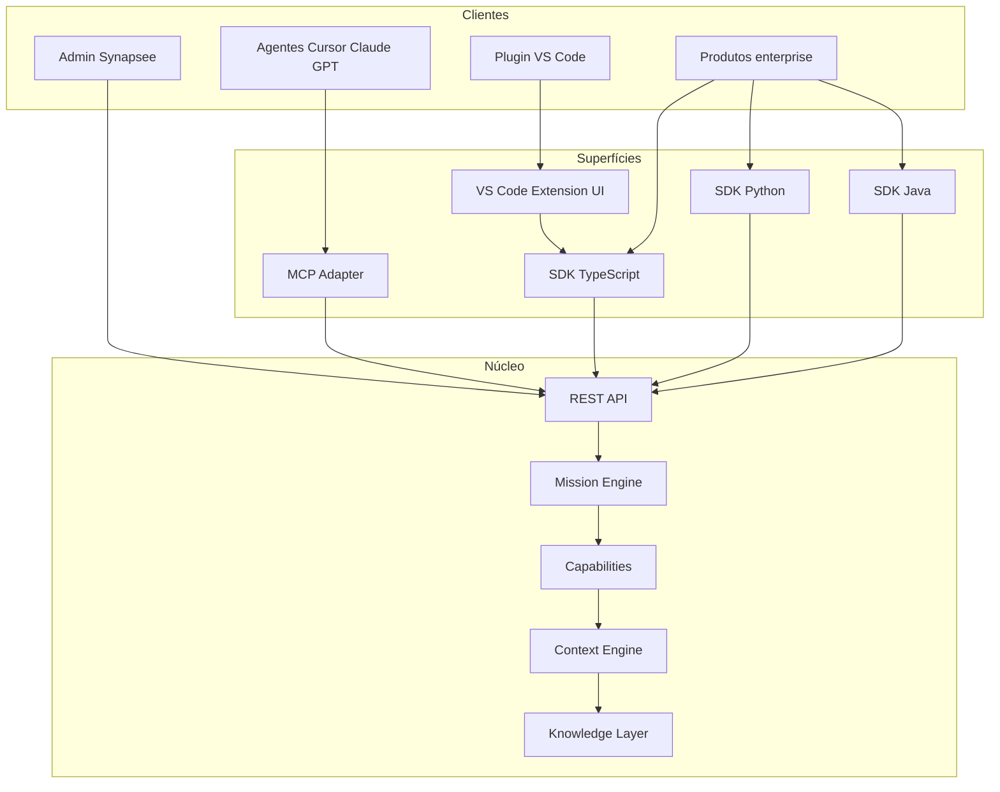
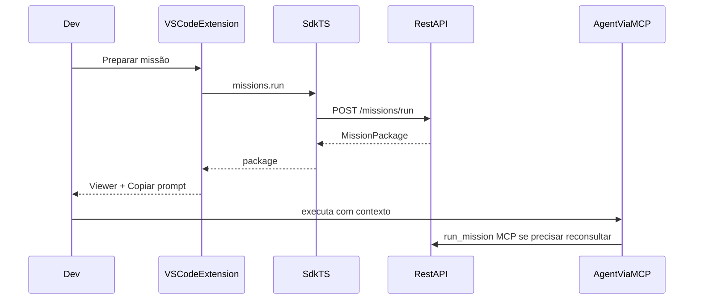

# Plano — Superfícies da plataforma Synapsee

> REST/Mission Engine como núcleo · MCP para agentes · Plugin VS Code para DX · SDKs para integração enterprise.
>
> O plugin **não** substitui o MCP. Eles têm papéis diferentes.

## Princípio de arquitetura



**Invariante:** toda superfície de produto (MCP, plugin, SDKs, Admin) consome o **mesmo contrato REST**. Ninguém bypassa o Mission Engine para inventar um segundo caminho de missão.

| Superfície | Papel | Não é |
|------------|--------|--------|
| **REST + Mission Engine** | Núcleo da plataforma (`runMission`, `getMissionPackage`, catálogo) | UI |
| **MCP** | Faz o agente *enxergar* o Synapsee como ferramenta (`list_missions`, `run_mission`) | IDE experience |
| **Plugin VS Code** | Melhor DX no editor (projetos, Mission Package, auth, runs) | Substituto do MCP |
| **SDK** | Empresas embutem Synapsee em produtos próprios | Protocolo de agente |

## Estado atual (base)

Já existe o núcleo:

- REST missions: [`apps/api/src/routes/missions.ts`](../apps/api/src/routes/missions.ts) — `GET/POST .../missions`, runs
- Mission Engine: [`packages/core/src/missions/`](../packages/core/src/missions/) — catalog + `runMission` + Mission Package
- MCP: [`packages/mcp/src/server.ts`](../packages/mcp/src/server.ts) — `list_missions` / `run_mission` + caps
- Snippets de cliente (incl. VS Code `.vscode/mcp.json`): [`packages/mcp/src/clients.ts`](../packages/mcp/src/clients.ts)
- Admin consome fetch fino: [`apps/admin/src/lib/api.ts`](../apps/admin/src/lib/api.ts)

Falta: `packages/sdk*`, extensão VS Code, contrato versionado/publicável, SDKs Python/Java.

[`PLAN.md`](./PLAN.md) já reserva `packages/sdk` como Fase 2 — este plano materializa essa camada e as superfícies adjacentes.

---

## Fase 0 — Contrato de plataforma (pré-requisito)

Congelar e documentar o **Platform API** como fonte da verdade:

1. **OpenAPI** gerado/manutido a partir das rotas de missão e projeto (mínimo: missions, mission runs, projects summary, health).
2. **Mission Package schema** versionado (JSON Schema) a partir de [`packages/core/src/missions/package.ts`](../packages/core/src/missions/package.ts) — campos business (`partyCards`, `discoveries`, `restrictions`, etc.) e engineering.
3. Entrypoints canônicos documentados:

```text
POST   /projects/:id/missions/run     → { missionId, params } → { runId, package }
GET    /projects/:id/missions         → catálogo filtrado por vertical
GET    /projects/:id/missions/runs/:runId
GET    /projects/:id/missions/runs
```

4. Manter alinhamento com [`PLAN-MISSION-ENGINE.md`](./PLAN-MISSION-ENGINE.md) e [`POSITIONING.md`](./POSITIONING.md).
5. Regra de ouro no MCP: tools de missão chamam a **mesma** lógica do REST (hoje já compartilham `runMission` em core — manter; evitar lógica duplicada no adapter).

**Saída:** contrato estável o suficiente para gerar o SDK TS.

---

## Fase 1 — SDK TypeScript (`@synapse/sdk`)

Criar [`packages/sdk`](../packages/sdk) (export público alinhado ao naming do monorepo).

Escopo v1 do client:

```ts
const syn = new SynapseeClient({ baseUrl, apiKey })
await syn.missions.list(projectId)
await syn.missions.run(projectId, { missionId: "collect_overdue", params: { limit: 20 } })
await syn.missions.getRun(projectId, runId)
// tipos: MissionPackage, MissionDefinition, MissionRun
```

- Reutilizar tipos de `@synapse/core` (Mission Package) — não duplicar.
- Extrair o fetch tipado de [`apps/admin/src/lib/api.ts`](../apps/admin/src/lib/api.ts) para o SDK; Admin passa a depender do SDK (migração gradual: missions primeiro).
- Auth: `X-API-Key` (igual API atual).
- Testes de contrato contra API local / smoke.

**Saída:** pacote publicável + Admin (missões) e futuros clientes no mesmo client.

---

## Fase 2 — Plugin VS Code (DX Engineering-first)

Novo app: `apps/vscode` (extension).

**Consome SDK TS + opcionalmente aponta MCP** — não substitui MCP.

Funcionalidades v1:

1. Login / API key + seleção de projeto
2. Painel **Missões** (lista + run + histórico de runs)
3. Viewer do **Mission Package** (status, descobertas, evidências, prompt) — espelha a UX rica de cobrança/Story no Admin
4. Ações: “Copiar prompt para o chat”, “Abrir run”
5. Comando: “Inserir config MCP no workspace” (usa snippets existentes de [`clients.ts`](../packages/mcp/src/clients.ts)) para o agente do Cursor/VS Code continuar via MCP

Fluxo do desenvolvedor:



**Prioridade vertical v1 do plugin:** Engineering (`implement_story`) — onde o DX no editor importa mais. Business missões aparecem se o projeto for business (mesmo SDK).

**Saída:** VSIX instalável; demo “Mission Package no editor + agente via MCP”.

---

## Fase 3 — SDK Python

`packages/sdk-python` (ou publish separado no PyPI).

- Client espelhando o TS: `missions.list/run/get_run`
- Tipos gerados a partir do OpenAPI/JSON Schema da Fase 0
- Auth `X-API-Key`
- README com exemplo enterprise (job interno chama `collect_overdue` e posta o package num ticket)

**Saída:** pacote pip + exemplos.

---

## Fase 4 — SDK Java

`packages/sdk-java` (Maven/Gradle).

- Mesmo contrato REST
- Tipos a partir do OpenAPI
- Foco enterprise (Spring Boot sample: endpoint interno que dispara missão e devolve Mission Package)

**Saída:** artefato Maven + sample.

---

## Papéis cruzados (checklist de produto)

- Agente no Cursor sem plugin → **só MCP** (já funciona).
- Dev com plugin + agente → plugin prepara/visualiza; agente executa via MCP/prompt.
- ERP/backoffice da empresa → **SDK** (Python/Java/TS), sem MCP obrigatório.
- Admin Synapsee → REST (via SDK TS após Fase 1).

Nunca posicionar o plugin como “o jeito de o agente falar com Synapsee”.

---

## Ordem de entrega e critérios

| Fase | Entrega | Critério de pronto |
|------|---------|-------------------|
| 0 | OpenAPI + JSON Schema Mission Package + este doc | Contrato revisável; MCP/REST compartilham engine |
| 1 | `@synapse/sdk` TS | `missions.run` + Admin missions no SDK; smoke test |
| 2 | Extensão VS Code | Run missão + viewer package + “Add MCP config” |
| 3 | SDK Python | Exemplo enterprise `collect_overdue` |
| 4 | SDK Java | Sample Spring + mesmo contrato |

Fora de escopo deste plano (próximo trilho): UI no Admin para *criar* missões dinamicamente; isso continua catálogo em código até o contrato de superfícies estabilizar.

## Arquivos / packages novos

- `docs/PLAN-PLATFORM-SURFACES.md` (este documento)
- `packages/sdk/` — TypeScript
- `apps/vscode/` — extension
- `packages/sdk-python/` — Python
- `packages/sdk-java/` — Java
- OpenAPI em `docs/openapi/platform.yaml` (ou gerado em `apps/api`)

## Riscos a conter

- Duplicar lógica de missão no MCP ou no plugin → sempre REST/core.
- Mission Package mudar sem versionar → quebra SDKs; usar `role` + version field se necessário (`missionPackageVersion`).
- Plugin tentar ser “MCP embutido” → manter MCP como protocolo de agente; plugin é UX.

## Ver também

- [POSITIONING.md](./POSITIONING.md)
- [PLAN-MISSION-ENGINE.md](./PLAN-MISSION-ENGINE.md)
- [PLAN-KNOWLEDGE-BUILDER.md](./PLAN-KNOWLEDGE-BUILDER.md) — Knowledge Builder + LLM provider
- [PLAN.md](./PLAN.md)
- [PLAN-STORY-OS.md](./PLAN-STORY-OS.md)
