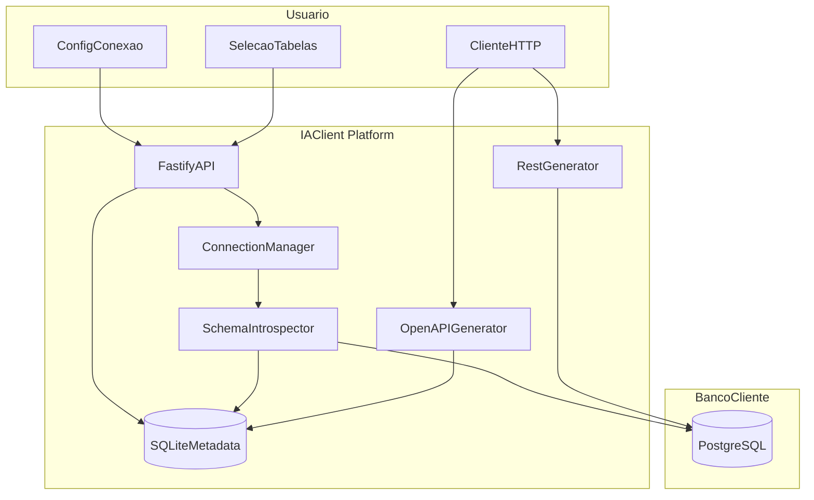
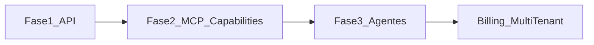

# Plano IAClient — Fase 1 MVP

> Stack: Node.js + TypeScript + Fastify  
> Escopo: Fase 1 — PostgreSQL → introspecção → API REST + OpenAPI

## Contexto

Projeto **greenfield** em `c:\Projeto\IAClient`. Stack escolhida: **Node.js + TypeScript + Fastify**. Escopo do primeiro entregável: **Fase 1** (PostgreSQL → introspecção → API REST + OpenAPI).

A proposta de longo prazo (capacidades de negócio, MCP, agentes, SaaS) orienta a arquitetura, mas **não entra no MVP** — apenas deixamos interfaces e pastas prontas para evoluir sem reescrever.

---

## Visão da arquitetura (Fase 1)



**Fluxo principal:**
1. Usuário registra conexão (host, porta, banco, usuário, senha).
2. Plataforma testa conexão e introspecta `information_schema`.
3. Usuário escolhe quais tabelas expor.
4. API dinâmica e `/openapi.json` ficam disponíveis para esse projeto.

---

## Stack técnica

| Camada | Escolha | Motivo |
|--------|---------|--------|
| Runtime | Node.js 20+ | Ecossistema forte para API, MCP e SDK futuros |
| Linguagem | TypeScript strict | Tipagem do schema introspectado |
| HTTP | Fastify | Leve, plugins maduros (swagger, rate-limit) |
| PostgreSQL client | `pg` | Queries dinâmicas sem ORM fixo |
| Validação | Zod | Schemas de request/response |
| Metadata local | SQLite via `better-sqlite3` | Perfis de conexão e tabelas expostas |
| OpenAPI | `@fastify/swagger` + geração dinâmica | `/openapi.json` e UI opcional |
| Monorepo | pnpm workspaces | Separa `core` (lógica) de `api` (servidor) |

**Não usar Prisma/Drizzle no alvo do cliente** — o schema é desconhecido e dinâmico; introspecção + SQL parametrizado é o caminho correto.

---

## Estrutura de pastas proposta

```
IAClient/
├── package.json                 # pnpm workspace root
├── pnpm-workspace.yaml
├── .env.example
├── README.md
├── apps/
│   └── api/
│       ├── package.json
│       └── src/
│           ├── main.ts
│           ├── plugins/         # auth, rate-limit (stubs Fase 2)
│           └── routes/
│               ├── connections.ts
│               ├── introspection.ts
│               ├── expose.ts
│               └── generated.ts   # rotas dinâmicas
└── packages/
    ├── core/
    │   └── src/
    │       ├── connection/      # testar + pool por projeto
    │       ├── introspection/   # information_schema
    │       ├── generator/
    │       │   ├── rest.ts
    │       │   └── openapi.ts
    │       └── types/           # TableMeta, ColumnMeta, Project
    └── storage/
        └── src/
            ├── projects.ts      # CRUD metadata SQLite
            └── crypto.ts        # criptografar senhas em repouso
```

Interfaces futuras (vazias ou com tipos apenas):
- `packages/core/src/capabilities/` — Fase 2 (ferramentas de negócio)
- `packages/mcp/` — Fase 2
- `packages/sdk/` — Fase 2

---

## Modelo de dados da plataforma (SQLite)

```typescript
// Conceitual — packages/core/src/types/project.ts
Project {
  id: string
  name: string
  host: string
  port: number
  database: string
  username: string
  passwordEncrypted: string
  exposedTables: string[]      // ex: ["clientes", "vendas"]
  createdAt: Date
}
```

Cada **Project** = 1 banco conectado. Na Fase 1, multi-banco = múltiplos projects (base para planos Starter/Pro depois).

---

## Módulos e responsabilidades

### 1. Connection Manager
- Endpoint: `POST /projects` — cria projeto e valida conexão (`SELECT 1`).
- Endpoint: `GET /projects/:id/test` — health check.
- Pool `pg` por project, com timeout e limite de conexões.
- Senha **nunca** retornada em responses; armazenada criptografada (`AES-256-GCM` + chave em `ENCRYPTION_KEY`).

### 2. Schema Introspector
Queries principais em `packages/core/src/introspection/`:

```sql
-- Tabelas
SELECT table_schema, table_name
FROM information_schema.tables
WHERE table_schema NOT IN ('pg_catalog', 'information_schema')
  AND table_type = 'BASE TABLE';

-- Colunas + tipos
SELECT column_name, data_type, is_nullable, column_default
FROM information_schema.columns
WHERE table_schema = $1 AND table_name = $2;

-- Primary key
SELECT kcu.column_name
FROM information_schema.table_constraints tc
JOIN information_schema.key_column_usage kcu ...
WHERE tc.constraint_type = 'PRIMARY KEY';
```

Endpoint: `GET /projects/:id/schema` — retorna tabelas, colunas, PKs e FKs (FKs ajudam na Fase 2 de “entendimento de negócio”).

### 3. Exposição de tabelas
- Endpoint: `PUT /projects/:id/expose` — body: `{ tables: ["clientes", "vendas"] }`.
- Valida que tabelas existem no schema introspectado (whitelist — **proteção contra SQL injection**).
- Regenera rotas e OpenAPI em memória.

### 4. REST Generator (dinâmico em runtime)
Para cada tabela exposta `clientes` com PK `id`:

| Método | Rota | Comportamento |
|--------|------|---------------|
| GET | `/p/:projectId/clientes` | Lista com paginação (`limit`, `offset`) |
| GET | `/p/:projectId/clientes/:id` | Busca por PK |
| POST | `/p/:projectId/clientes` | Insert (colunas não-PK com default/nullable) |

Regras de segurança:
- Nomes de tabela/coluna validados com regex `^[a-zA-Z_][a-zA-Z0-9_]*$` + whitelist.
- Queries sempre parametrizadas (`$1`, `$2`); identificadores quotados com `pg-format` ou escape seguro.
- Sem `DELETE`/`PUT` no MVP (reduz superfície de ataque).

Prefixo `/p/:projectId/` isola projetos e prepara multi-tenant.

### 5. OpenAPI Generator
- Endpoint: `GET /p/:projectId/openapi.json`
- Gera spec a partir de `exposedTables` + metadados de colunas.
- Opcional: `GET /p/:projectId/docs` com Swagger UI.

### 6. Análise de schema (preparação Fase 2 — stub no MVP)
- Endpoint: `GET /projects/:id/schema/summary` retorna apenas metadados estruturados.
- **Não chamar LLM na Fase 1** — mas deixar interface `analyzeSchema(schema): Promise<SchemaSummary>` para plugar OpenAI/Anthropic depois com sugestões do tipo “parece sistema de academia”.

---

## API da plataforma (Fase 1)

**Gestão:**
- `POST /projects` — criar conexão
- `GET /projects` — listar
- `GET /projects/:id` — detalhe (sem senha)
- `DELETE /projects/:id` — remover
- `GET /projects/:id/schema` — introspecção completa
- `PUT /projects/:id/expose` — definir tabelas expostas

**Gerada (por projeto):**
- `GET /p/:projectId/{tabela}`
- `GET /p/:projectId/{tabela}/:id`
- `POST /p/:projectId/{tabela}`
- `GET /p/:projectId/openapi.json`

---

## Segurança mínima no MVP

Incluir desde o início (mesmo que simples):

- API key da plataforma via header `X-API-Key` (env `PLATFORM_API_KEY`) — base para JWT multi-usuário depois.
- Rate limit: `@fastify/rate-limit` (ex.: 100 req/min por IP).
- Logs estruturados com `pino` (request id, projectId, tabela, duração).
- Credenciais do banco cliente nunca em logs.

JWT, RBAC e quotas por plano ficam para quando o SaaS existir.

---

## Roadmap pós-MVP (referência, fora do escopo atual)



| Fase | Entrega | Diferencial |
|------|---------|-------------|
| **1 (MVP)** | REST + OpenAPI dinâmicos | Banco vira API em minutos |
| **2** | MCP Server + ferramentas de negócio via LLM | “Consultar inadimplentes”, não só CRUD |
| **3** | Agentes especializados (retenção, financeiro) | Valor SaaS real |
| **SaaS** | Planos Starter/Pro/Agency, billing, multi-tenant | R$49 / R$149 / Agency |

---

## Ordem de implementação

1. **Bootstrap** — pnpm workspace, TypeScript, ESLint, `.env.example`, README com quickstart.
2. **Storage** — SQLite + model `Project` + criptografia de senha.
3. **Connection + Introspection** — conectar, listar tabelas/colunas/PKs.
4. **Expose tables** — persistir seleção e recarregar metadados.
5. **REST Generator** — rotas dinâmicas GET list, GET by id, POST.
6. **OpenAPI** — spec dinâmica + Swagger UI.
7. **Hardening** — API key, rate limit, validação de identificadores SQL.
8. **Smoke test** — script com PostgreSQL local (Docker) validando fluxo ponta a ponta.

---

## Exemplo de validação manual (critério de pronto)

```bash
# 1. Criar projeto
curl -X POST http://localhost:3000/projects \
  -H "X-API-Key: dev-key" \
  -d '{"name":"academia","host":"localhost","port":5432,"database":"academia","username":"postgres","password":"..."}'

# 2. Introspectar
curl http://localhost:3000/projects/{id}/schema

# 3. Expor tabelas
curl -X PUT http://localhost:3000/projects/{id}/expose \
  -d '{"tables":["alunos","pagamentos"]}'

# 4. Usar API gerada
curl http://localhost:3000/p/{id}/alunos?limit=10
curl http://localhost:3000/p/{id}/openapi.json
```

---

## Riscos e mitigações

| Risco | Mitigação |
|-------|-----------|
| SQL injection em API dinâmica | Whitelist de tabelas + identificadores validados + queries parametrizadas |
| Schemas complexos (views, JSONB, arrays) | MVP: tipos simples; documentar limitações; evoluir mapeamento OpenAPI na Fase 2 |
| Performance em tabelas grandes | Paginação obrigatória; `limit` máximo (ex. 100) |
| Senhas em repouso | Criptografia + nunca expor em API/logs |
| CRUD genérico de baixo valor | Fase 1 entrega infraestrutura; Fase 2 muda o produto para “capacidades” |

---

## Entregável da Fase 1

Um servidor Fastify executável que, dado host/porta/banco/usuário/senha, introspecta PostgreSQL, permite escolher tabelas e expõe **REST + OpenAPI** dinamicamente — com arquitetura modular pronta para MCP, análise por IA e agentes nas próximas fases.

---

## Tarefas de implementação

- [ ] Inicializar monorepo pnpm (apps/api + packages/core + packages/storage), TypeScript strict, Fastify, .env.example e README
- [ ] Implementar SQLite metadata store, model Project e criptografia de senhas
- [ ] Connection manager + introspecção information_schema (tabelas, colunas, PKs, FKs)
- [ ] API de gestão de projetos e endpoint PUT /expose com whitelist de tabelas
- [ ] Gerador dinâmico REST: GET list, GET by id, POST por tabela exposta
- [ ] Gerador OpenAPI dinâmico em /p/:projectId/openapi.json + Swagger UI opcional
- [ ] API key, rate limit, logs pino, validação anti-SQL-injection
- [ ] Docker Compose PostgreSQL de exemplo + script/collection validando fluxo ponta a ponta
