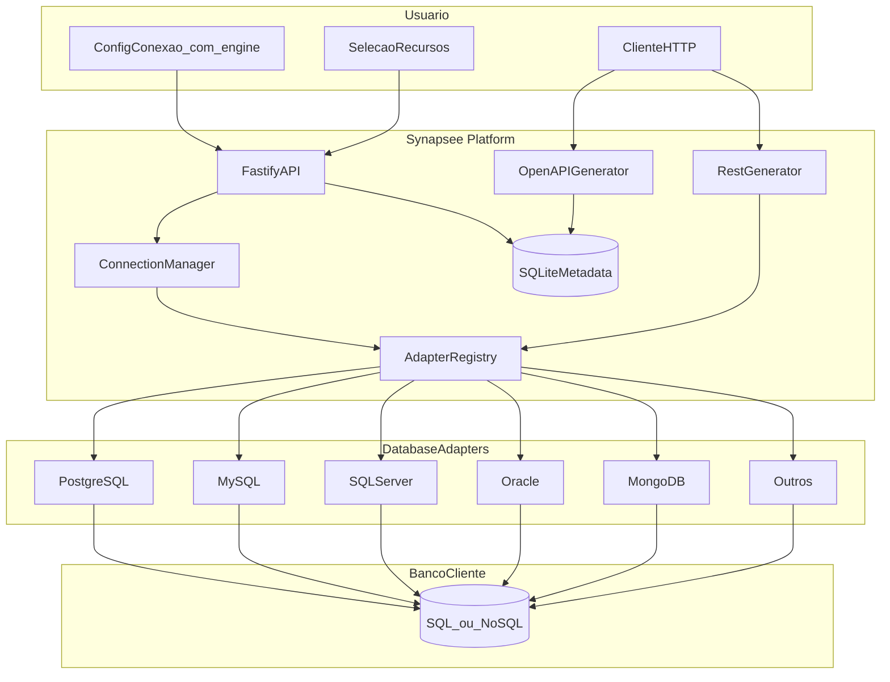
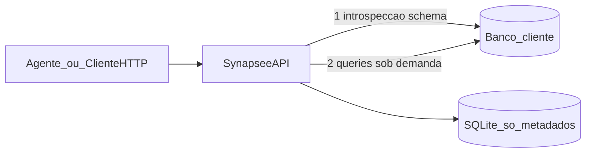
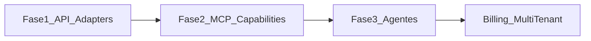

# Plano Synapsee IA — Fase 1 MVP (multi-banco)

> Stack: Node.js + TypeScript + Fastify  
> Escopo: Fase 1 — **qualquer banco (SQL ou NoSQL)** via adapters → introspecção → API REST + OpenAPI  
> Adapter de referência no MVP: **PostgreSQL** (os demais entram por interface + roadmap)

## Contexto

Projeto **greenfield** em `c:\Projeto\IAClient`. Stack: **Node.js + TypeScript + Fastify**.

Posicionamento do produto: **conectar qualquer sistema à IA em minutos** — o cliente escolhe o banco (PostgreSQL, SQL Server, MySQL, Oracle, MongoDB, etc.); a plataforma introspecta o schema/coleções e gera API + (depois) MCP **sem importar dados**.

A proposta de longo prazo (capacidades de negócio, MCP, agentes, SaaS) orienta a arquitetura, mas **não entra no MVP** — apenas interfaces e pastas prontas para evoluir sem reescrever.

---

## Visão da arquitetura (Fase 1)



**Fluxo principal:**
1. Usuário registra conexão: **engine** (ex.: `postgresql`), host, porta, banco, usuário, senha (e opções específicas do engine).
2. Plataforma resolve o adapter, testa conexão e introspecta o schema / coleções.
3. Usuário escolhe quais **recursos** expor (tabelas SQL ou coleções NoSQL).
4. API dinâmica e `/openapi.json` ficam disponíveis para esse projeto.

---

## Princípio de dados (obrigatório)

**A plataforma nunca importa, copia, faz dump nem replica a base do cliente.**

Os dados de negócio permanecem no ambiente do cliente. O Synapsee só:

| Faz | Não faz |
|-----|---------|
| Conecta no banco remoto do cliente (SQL ou NoSQL) | Dump / restore / export bulk |
| Lê metadados de schema (tabelas/coleções, campos, chaves, índices) | Copiar documentos ou linhas inteiras |
| Guarda no SQLite só metadados da plataforma (credenciais criptografadas, recursos expostos, engine) | Hospedar uma segunda cópia dos dados do cliente |
| Em cada request da API/MCP, consulta **ao vivo** no banco do cliente via adapter | ETL / sync periódico para storage nosso |



**Motivos:** privacidade/LGPD, menor superfície de ataque, dados sempre atuais, escala sem storage proporcional ao cliente.

**Preferência de conexão:** usuário com permissão **somente leitura** quando o caso de uso for consulta.

---

## Arquitetura de adapters (multi-banco)

Toda lógica específica de vendor fica atrás de uma interface comum. Core e API **não** conhecem drivers (`pg`, `mongodb`, etc.) diretamente.

```typescript
// packages/core/src/adapters/types.ts (conceitual)

type DatabaseEngine =
  | "postgresql"
  | "mysql"
  | "sqlserver"
  | "oracle"
  | "mongodb"
  | "sqlite"      // remoto/file — futuro
  | "mariadb"     // alias MySQL
  | string        // extensível

interface ConnectionConfig {
  engine: DatabaseEngine
  host: string
  port: number
  database: string
  username: string
  password: string
  options?: Record<string, unknown>  // SSL, authSource, serviceName, etc.
}

/** Recurso genérico: tabela SQL ou collection NoSQL */
interface ResourceMeta {
  name: string                 // "clientes" | "orders"
  schema?: string              // SQL: public, dbo...
  kind: "table" | "collection" | "view"
  fields: FieldMeta[]
  primaryKey?: string[]
  foreignKeys?: ForeignKeyMeta[]
}

interface SchemaSnapshot {
  engine: DatabaseEngine
  resources: ResourceMeta[]
}

interface DatabaseAdapter {
  readonly engine: DatabaseEngine
  testConnection(config: ConnectionConfig): Promise<void>
  introspect(config: ConnectionConfig): Promise<SchemaSnapshot>
  list(
    config: ConnectionConfig,
    resource: ResourceMeta,
    opts: { limit: number; offset: number; filter?: Record<string, unknown> }
  ): Promise<unknown[]>
  getById(
    config: ConnectionConfig,
    resource: ResourceMeta,
    id: string | number
  ): Promise<unknown | null>
  insert(
    config: ConnectionConfig,
    resource: ResourceMeta,
    data: Record<string, unknown>
  ): Promise<unknown>
  close?(projectId: string): Promise<void>
}
```

### Mapeamento SQL vs NoSQL

| Conceito unificado | SQL | NoSQL (ex. MongoDB) |
|--------------------|-----|---------------------|
| Resource | tabela / view | collection |
| Field | coluna tipada | campo inferido por sample + indexes |
| Primary key | PK / serial | `_id` |
| List / getById / insert | `SELECT` / `INSERT` | `find` / `findOne` / `insertOne` |
| Introspecção | `information_schema` / catalog | `listCollections` + sample docs + indexes |

### Engines suportados (roadmap)

| Engine | Família | MVP | Notas |
|--------|---------|-----|-------|
| **PostgreSQL** | SQL | **Sim (referência)** | Primeiro adapter completo |
| MySQL / MariaDB | SQL | Pronto (adapter `mysql`) | `information_schema` + `mysql2` |
| SQL Server | SQL | Pós-MVP | Catalog `sys` / `INFORMATION_SCHEMA` |
| Oracle | SQL | Pós-MVP | `ALL_TABLES` / `ALL_TAB_COLUMNS` |
| **MongoDB** | NoSQL | Pós-MVP (prioridade NoSQL) | Collections + sample schema |
| Redis / Elasticsearch / DynamoDB | NoSQL | Futuro | Só se houver demanda clara |

Novos engines = novo arquivo em `packages/core/src/adapters/<engine>/` + registro no `AdapterRegistry`. Sem mudar rotas da API.

---

## Stack técnica

| Camada | Escolha | Motivo |
|--------|---------|--------|
| Runtime | Node.js 20+ | Ecossistema forte para API, MCP e SDK |
| Linguagem | TypeScript strict | Tipagem do schema unificado |
| HTTP | Fastify | Leve, plugins maduros |
| Drivers (por adapter) | `pg`, `mysql2`, `mssql`, `oracledb`, `mongodb` | Só no adapter correspondente |
| Validação | Zod | Request/response + config por engine |
| Metadata local | SQLite via `better-sqlite3` | Só metadados da plataforma — **nunca dados do cliente** |
| OpenAPI | geração dinâmica | `/openapi.json` e UI opcional |
| Monorepo | npm/pnpm workspaces | `core` (adapters + generators) separado de `api` |

**Não usar Prisma/Drizzle no alvo do cliente** — schema dinâmico e multi-engine; adapter + queries/comandos parametrizados.

---

## Estrutura de pastas proposta

```
IAClient/
├── package.json
├── apps/
│   └── api/
│       └── src/
│           ├── main.ts
│           ├── plugins/
│           └── routes/
│               ├── connections.ts
│               ├── introspection.ts
│               ├── expose.ts
│               └── generated.ts
└── packages/
    ├── core/
    │   └── src/
    │       ├── adapters/
    │       │   ├── types.ts              # DatabaseAdapter, SchemaSnapshot
    │       │   ├── registry.ts           # resolve(engine) → adapter
    │       │   ├── postgresql/           # MVP — implementação completa
    │       │   ├── mysql/                # ready (mysql2)
    │       │   ├── sqlserver/            # stub
    │       │   ├── oracle/               # stub
    │       │   └── mongodb/              # stub NoSQL
    │       ├── connection/               # orquestra test + pool via registry
    │       ├── generator/
    │       │   ├── rest.ts               # usa adapter.list/getById/insert
    │       │   └── openapi.ts
    │       └── types/
    └── storage/
        └── src/
            ├── projects.ts
            └── crypto.ts
```

Interfaces futuras:
- `packages/core/src/capabilities/` — Fase 2
- `packages/mcp/` — Fase 2
- `packages/sdk/` — Fase 2

---

## Modelo de dados da plataforma (SQLite)

```typescript
Project {
  id: string
  name: string
  engine: DatabaseEngine       // "postgresql" | "mysql" | "mongodb" | ...
  host: string
  port: number
  database: string
  username: string
  passwordEncrypted: string
  optionsJson?: string         // SSL, authSource, serviceName, etc.
  exposedResources: string[]   // tabelas ou collections — ex: ["clientes", "orders"]
  createdAt: Date
}
```

Cada **Project** = 1 conexão a 1 banco. Multi-banco do cliente = múltiplos projects (base para planos Starter/Pro).

---

## Módulos e responsabilidades

### 1. Connection Manager + Adapter Registry
- `POST /projects` — body inclui `engine`; resolve adapter; valida conexão (`testConnection`).
- `GET /projects/:id/test` — health check via adapter.
- Pool / client por project (implementação interna do adapter).
- Senha **nunca** em responses; criptografada (`AES-256-GCM` + `ENCRYPTION_KEY`).

### 2. Schema Introspector (por adapter)

**SQL (PostgreSQL — referência MVP):**

```sql
SELECT table_schema, table_name
FROM information_schema.tables
WHERE table_schema NOT IN ('pg_catalog', 'information_schema')
  AND table_type = 'BASE TABLE';

SELECT column_name, data_type, is_nullable, column_default
FROM information_schema.columns
WHERE table_schema = $1 AND table_name = $2;
```

**NoSQL (MongoDB — roadmap):**
- `listCollections()`
- Sample de N documentos + índices → inferir `FieldMeta[]`
- `_id` como primary key padrão

Endpoint unificado: `GET /projects/:id/schema` → `SchemaSnapshot` (engine-agnostic).

### 3. Exposição de recursos
- `PUT /projects/:id/expose` — body: `{ resources: ["clientes", "vendas"] }`.
- Valida contra o schema introspectado (whitelist).
- Regenera rotas e OpenAPI.

### 4. REST Generator (dinâmico)
Para cada recurso exposto `clientes`:

| Método | Rota | Comportamento |
|--------|------|---------------|
| GET | `/p/:projectId/clientes` | Lista com paginação (`limit`, `offset`) |
| GET | `/p/:projectId/clientes/:id` | Busca por PK / `_id` |
| POST | `/p/:projectId/clientes` | Insert (quando permitido) |

Regras de segurança:
- Nomes validados + whitelist do expose.
- SQL: queries parametrizadas; NoSQL: filtros tipados / builders seguros (nunca string crua do usuário).
- Sem `DELETE`/`PUT` no MVP.

### 5. OpenAPI Generator
- `GET /p/:projectId/openapi.json` a partir de `exposedResources` + `FieldMeta`.
- Opcional: Swagger UI.

### 6. Análise de schema (stub Fase 2)
- `GET /projects/:id/schema/summary`
- Interface `analyzeSchema(snapshot): Promise<SchemaSummary>` para LLM depois.

---

## API da plataforma (Fase 1)

**Gestão:**
- `POST /projects` — criar conexão (`engine` obrigatório)
- `GET /projects` — listar
- `GET /projects/:id` — detalhe (sem senha)
- `DELETE /projects/:id` — remover
- `GET /projects/:id/schema` — introspecção
- `PUT /projects/:id/expose` — `{ resources: string[] }`
- `GET /engines` — lista engines disponíveis e status (`ready` | `planned`)

**Gerada (por projeto):**
- `GET /p/:projectId/{recurso}`
- `GET /p/:projectId/{recurso}/:id`
- `POST /p/:projectId/{recurso}`
- `GET /p/:projectId/openapi.json`

Exemplo de criação:

```bash
curl -X POST http://localhost:3000/projects \
  -H "X-API-Key: dev-key" \
  -H "Content-Type: application/json" \
  -d '{
    "name":"academia",
    "engine":"postgresql",
    "host":"localhost",
    "port":5432,
    "database":"academia",
    "username":"readonly",
    "password":"..."
  }'
```

---

## Segurança mínima no MVP

- API key `X-API-Key` (`PLATFORM_API_KEY`).
- Rate limit `@fastify/rate-limit`.
- Logs `pino` (request id, projectId, engine, resource) — **sem** credenciais.
- Whitelist de recursos + validação por adapter.
- Preferir conexões read-only no cliente.

---

## Roadmap pós-MVP



| Fase | Entrega | Diferencial |
|------|---------|-------------|
| **1 (MVP)** | Adapter registry + PostgreSQL + REST/OpenAPI | Qualquer banco *na arquitetura*; PG na prática |
| **1.1** | MySQL + SQL Server | Cobrir maioria dos ERPs |
| **1.2** | MongoDB | Primeiro NoSQL |
| **1.3** | Oracle (+ outros sob demanda) | Enterprise |
| **2** | MCP + ferramentas de negócio via LLM | Capacidades, não só CRUD |
| **3** | Agentes especializados | Retenção, financeiro, comercial |
| **SaaS** | Planos Starter/Pro/Agency | Billing + multi-tenant |

Alinhamento com a landing (form Beta): opções PostgreSQL / SQL Server / MySQL / Oracle / Outro devem mapear para `engine` no `POST /projects`.

---

## Ordem de implementação

1. **Bootstrap** — workspace, TypeScript, Fastify, `.env.example`, README.
2. **Storage** — SQLite + `Project` com campo `engine` + crypto.
3. **Adapter contracts + registry** — `DatabaseAdapter`, `SchemaSnapshot`, `AdapterRegistry`.
4. **PostgreSQL adapter** — test, introspect, list, getById, insert.
5. **Adapters** — PostgreSQL + MySQL prontos; stubs: sqlserver, oracle, mongodb.
6. **Expose + REST + OpenAPI** — genéricos sobre o adapter.
7. **Hardening** — API key, rate limit, whitelist.
8. **Smoke test** — Docker Compose PostgreSQL + fluxo ponta a ponta.
9. **(Pós-MVP)** — implementar próximo adapter pela demanda dos leads do Beta.

---

## Riscos e mitigações

| Risco | Mitigação |
|-------|-----------|
| Complexidade multi-engine cedo demais | MVP só PostgreSQL completo; demais = stubs tipados |
| SQL / NoSQL injection | Whitelist + queries/builders parametrizados por adapter |
| Importação acidental de dados | Princípio explícito; SQLite nunca guarda linhas de negócio |
| Schema NoSQL fraco (docs heterogêneos) | Inferência por sample + documentar limitações |
| Drivers nativos pesados (Oracle) | Adapter opcional / lazy load |
| Performance em collections grandes | Paginação obrigatória; `limit` máximo |

---

## Entregável da Fase 1

Um servidor Fastify com **arquitetura multi-banco (SQL e NoSQL) via adapters**, implementação completa dos adapters **PostgreSQL** e **MySQL**, stubs para SQL Server / Oracle / MongoDB, e exposição dinâmica de **REST + OpenAPI** — sem importar dados do cliente — preparado para MCP e agentes nas fases seguintes.

## Entregável da Fase 2 (MCP)

- Pacote `@synapse/mcp` com tools: `list_exposed_resources`, `describe_resource`, `query_records`, `get_record`, `create_record`
- Endpoint Streamable HTTP: `POST /p/:projectId/mcp` (+ manifesto `GET /p/:projectId/mcp.json`)
- Admin exibe URL MCP + snippet Cursor `mcp.json`
- Tools consultam o banco do cliente **ao vivo** via o mesmo `DatabaseAdapter` (sem importar dados)

## Inteligência de negócio

Ver [`docs/PLAN-BUSINESS-AI.md`](./PLAN-BUSINESS-AI.md) (Fases A–D) e posicionamento em [`docs/POSITIONING.md`](./POSITIONING.md) — conexão é infra; valor = packs/playbooks confirmáveis no MCP.

---

## Tarefas de implementação

- [ ] Inicializar monorepo (apps/api + packages/core + packages/storage), TypeScript strict, Fastify, `.env.example` e README
- [ ] SQLite metadata store + model `Project` com `engine` + criptografia de senhas
- [ ] Contratos `DatabaseAdapter` / `SchemaSnapshot` + `AdapterRegistry`
- [x] Adapter PostgreSQL completo (test, introspect, list, getById, insert)
- [x] Adapter MySQL completo (test, introspect, list, getById, insert)
- [ ] Stubs tipados: sqlserver, oracle, mongodb
- [ ] API de projetos + `PUT /expose` com whitelist de recursos
- [ ] Gerador REST dinâmico sobre o adapter ativo
- [ ] Gerador OpenAPI + Swagger UI opcional
- [ ] API key, rate limit, logs pino, validação anti-injection
- [ ] Docker Compose PostgreSQL + smoke test ponta a ponta
- [ ] Endpoint `GET /engines` listando engines ready vs planned
